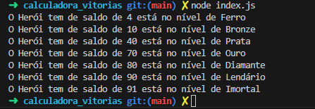
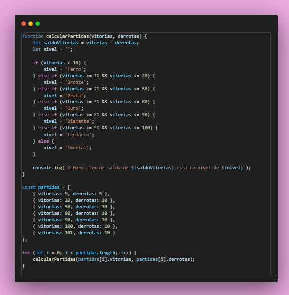
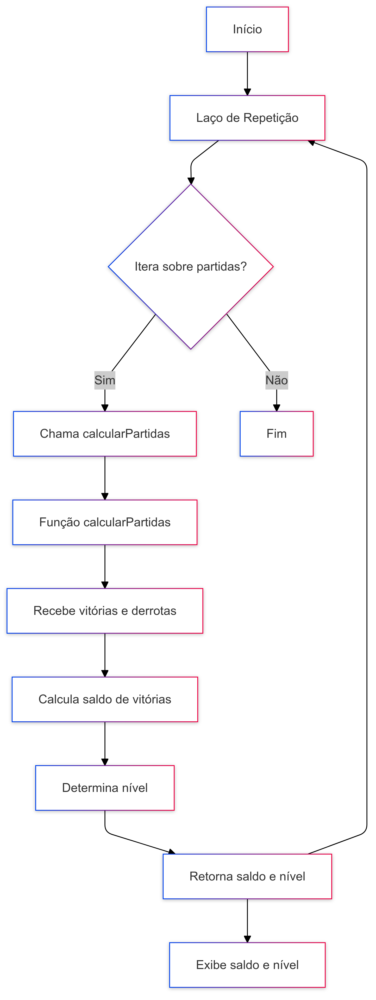

# 🏆 Calculadora de Partidas Rankeadas

## 📜 Descrição

Este projeto é uma calculadora de partidas rankeadas que determina o nível de um jogador com base no número de vitórias e derrotas. O saldo de partidas é calculado como a diferença entre vitórias e derrotas, e o nível é determinado de acordo com a quantidade de vitórias.

## 🛠️ Tecnologias Utilizadas

- JavaScript
- Node.js

## 🚀 Instalação

1. Clone o repositório:

    ```bash
    git clone https://github.com/GrazielleNascimento/Calculadora_de_partidas_Rankeadas_dio.git
    ```

2. Navegue até o diretório do projeto:

    ```bash
    cd calculadora_vitorias
    ```

3. Instale as dependências:

    ```bash
    npm install
    ```

## ▶️ Execução

Com o node e o npm já instalado na sua máquina.
Para executar o projeto, utilize o seguinte comando:

```bash
node index.js
```

## 💡Exemplo de Execução



## 👩‍💻 Código



📊 Fluxograma do Projeto


